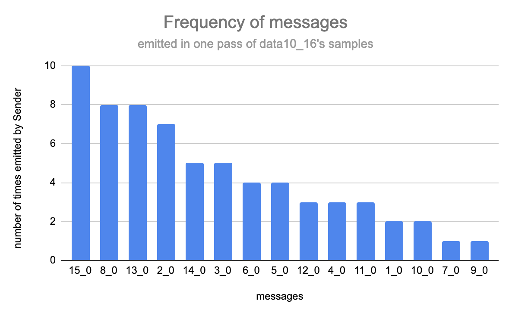
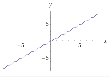

# Mini-MAS Project Report

This project was created by Etiene Dalcol as part of the application process for a PhD position supervised by Dr. Marco Baroni at University Pompeu Fabra.

- [PhD call](https://marcobaroni.org/alien/calls/alien-phd-call.txt)
- [Source code](https://github.com/Etiene/minimasproject)
- [Project management dashboard](https://www.notion.so/PhD-application-mini-project-d291e8842054419da219bd8ca98f5532)

## Introduction

The aim of this project is to create a multi-agent model to investigate the emergence of language using the [EGG toolkit](https://github.com/facebookresearch/EGG). The model must have two agents, a sender and a receiver, where each of them is a neural network, which are trained to communicate in order to complete a task. The task which they have to solve is adding two whole numbers ranging from 0 to N. The sender receives the pair of numbers as an input and sends a discrete message to the receiver, which then must give us the sum.

Input ([11,45]) —> Agent 1 ("Sender") - - - ***message*** - - - > Agent 2 ("Receiver") —> Output (56)

With the exception of the restriction on the length of the exchanges and other similar hyperparameters such as the size of the vocabulary, the agents have the freedom to come up with the best way to communicate so they coordinate for the solution of the task. As they come up with their messages, it is possible to investigate what these messages correspond to and conduct an analysis of the emergence of language.

## Implementation

The implementation of this model uses the [EGG (Emergence of lanGuage in Games) toolkit](https://github.com/facebookresearch/EGG), a toolkit for emergence analysis created by Facebook Research. This toolkit is written in Python 3.6, and is based on [PyTorch](https://pytorch.org/). Through EGG, it is possible to create several kinds of agents, by wrapping a neural network architecture in one of its ready components that handle the communication between agents. The version of EGG used for this project was a fresh installation off the main branch of its GitHub repository, with [some modifications](https://github.com/facebookresearch/EGG/commits/7082995ed377a0cc753ef906be1333d5abac1764) since its version 2.0 release.

The EGG toolkit repository has several usage examples, contained at the sub-directory `egg/zoo`. One of the examples, `basic_games`, implements models for two types of tasks and was used as a base for the implementation of this project's model. The final implementation of this project's code can be found at its [GitHub repository](https://github.com/Etiene/minimasproject), and is licensed under an MIT license.

### Data Preparation

The first implementation step was to adapt the code that reads the data for digestion by the model. The dataset is created through a function that generates random numbers that sum up to a specified integer, capped on the maximum amount of samples that can be generated or a specified number of samples. The samples are then split into two text files, a training and a validation set, containing 3 numbers separated by a space per line. The first two numbers are wrapped in a vector to be sent as the input to te Sender, and the last number, the sum of the previous numbers, is used as the label.

### Architecture

The first task of the `basic_games` example, a reconstruction game, also has a Sender and a Receiver as agents. However, the format of its input and output is a discrete variable length vector. For the task at hand of adding two numbers, this was adapted to work with a continuous output as a regression model. The reasoning for that was that since the input and output numbers could be any positive whole numbers, operating with classifiers would mean working with a possibly very large number of classes and a more complex model that could take longer to train since more parameters would be needed for the output.

#### **Agents**

The inner user-defined architecture is a simple linear transformation of size  2 by `sender_hidden_size` for the sender and `receiver_hidden_size` by 1, for the receiver. The architecture for each agent is then wrapped by the EGG toolkit's architecture and the sizes of the hidden layers can be configured when running the training.

EGG provides wrappers for two types of strategy for learning on its discrete message: Gumbel-Softmax and REINFORCE. These strategies are independent of the inner user-defined model architecture. That means that the Gumbel-Softmax strategy, which is used for discrete sampling, can still be used when dealing with a task operating on a continuous space. These strategies affect solely the communication channel between the agents. However, possibly due to an implementation issue, the model failed to train using the Gumbel-Softmax approach, and for this reason the REINFORCE approach was used. This project utilizes the REINFORCE wrappers in a hybrid approach: the sender is stochastic and optimized using reinforcement techniques, and the receiver is deterministic and optimized through backpropagation.

#### **Loss and accuracy**

To have a regression model, it was necessary to adapt the example to work with an appropriate loss function. Mean squared loss was chosen for simplicity as it is a standard function used for calculating this type of loss. Moreover, since the data is generated, it does not contain noise or very distant outliers, which could be a reason to explore using different functions. The regression approach, however, poses problems for calculating the accuracy, as outputs very close to the label, but just slightly different, would be counted as incorrect. One possible solution would be to use a rounding function at the output. Although the REINFORCE strategy does not necessarily require that the loss function must be differentiable, unlike the Gumbel-Softmax approach, the deterministic receiver does. Since the round function is not differentiable, it could not be used. As an alternative mitigation, the  `torch.isclose`  function was used with an absolute tolerance of 0.5 to calculate the accuracy. That means a prediction will be counted as correct if the label is the output's nearest integer.

## Methodology

### Datasets

A dataset was created by generating random samples that summed up to 1000. However, due to the computing resources and time required to train a model, this dataset was discarded and other, smaller, datasets were generated. This was done as an attempt to first try to obtain a model that could converge, so the messages could be analysed, before trying to explore training with bigger datasets. In the end, three different datasets were kept, shown in the table below. The total amount of samples was either a defined limit or capped by the maximum possible combination of numbers that could be summed to reach the maximum integer. The training and validation sets were defined by splitting each dataset randomly in a 8:2 ratio.

| Name    | Min Integer | Max Integer | Train samples | Validation samples |
|---------|-------------|-------------|---------------|--------------------|
| data100 | 0           | 100         | 800           | 200                |
| data30  | 0           | 30          | 396           | 100                |
| data10  | 0           | 10          | 52            | 14                 |


### Parameters

Different models were trained, exploring the effect of different parameters, namely: vocabulary size, hidden layers size, embedding size, message length and the entropy coefficient for the sender.

### Experiment

The experiments were conducted in two parts. The first one was the exploratory and debugging phase of the model's implementation. The second consisted of fine tuning and better exploration of the parameters, while analyzing results.

#### **1 -  Exploration and debugging**

This part of the experiment was run at the command line and allowed getting a rough intuition of what was helping with the model's learning or not. For this stage, a custom printer class was developed extending EGG's `PrintValidationEvents`  and used as a callback during training.  The goal was to get a counter of the number of symbols seen, and get the resulting predictions of the test set after the last epoch in a way that focused on readability per input.

Example output from original `PrintValidationEvents`:

```
INPUTS
[[4.0, 4.0], [5.0, 2.0], [3.0, 7.0], [5.0, 0.0], [1.0, 2.0], [8.0, 2.0], [7.0, 0.0], [1.0, 3.0], [10.0, 0.0], [1.0, 7.0], [0.0, 8.0], [9.0, 0.0], [5.0, 5.0], [7.0, 2.0]]
LABELS
[[8.0], [7.0], [10.0], [5.0], [3.0], [10.0], [7.0], [4.0], [10.0], [8.0], [8.0], [9.0], [10.0], [9.0]]
MESSAGES
[[4, 0], [4, 0], [4, 0], [4, 0], [15, 0], [4, 0], [4, 0], [15, 0], [4, 0], [4, 0], [4, 0], [4, 0], [4, 0], [4, 0]]
OUTPUTS
[[0.3567729592323303], [0.3567729592323303], [0.3567729592323303], [0.3567729592323303], [0.3843543529510498], [0.3567729592323303], [0.3567729592323303], [0.3843543529510498], [0.3567729592323303], [0.3567729592323303], [0.3567729592323303], [0.3567729592323303], [0.3567729592323303], [0.3567729592323303]]
```

Example output from `CustomPrintValidationEvents`:

```
Input [2.0, 0.0]	-> Message [4, 0]	-> Output [3.455]	(Label was: [2.0])
Input [3.0, 7.0]	-> Message [11, 0]	-> Output [9.035]	(Label was: [10.0])
Input [2.0, 1.0]	-> Message [4, 0]	-> Output [3.455]	(Label was: [3.0])
Input [0.0, 8.0]	-> Message [11, 0]	-> Output [9.035]	(Label was: [8.0])
Input [5.0, 5.0]	-> Message [11, 0]	-> Output [9.035]	(Label was: [10.0])
Input [0.0, 1.0]	-> Message [4, 0]	-> Output [3.455]	(Label was: [1.0])
Input [1.0, 0.0]	-> Message [4, 0]	-> Output [3.455]	(Label was: [1.0])
Input [1.0, 7.0]	-> Message [6, 0]	-> Output [8.536]	(Label was: [8.0])
Input [0.0, 2.0]	-> Message [4, 0]	-> Output [3.455]	(Label was: [2.0])
Input [4.0, 0.0]	-> Message [2, 0]	-> Output [5.08]	(Label was: [4.0])
Input [0.0, 7.0]	-> Message [12, 0]	-> Output [6.768]	(Label was: [7.0])
Input [0.0, 0.0]	-> Message [4, 0]	-> Output [3.455]	(Label was: [0.0])
Input [1.0, 8.0]	-> Message [11, 0]	-> Output [9.035]	(Label was: [9.0])
Input [1.0, 5.0]	-> Message [7, 0]	-> Output [6.295]	(Label was: [6.0])
Number of unique symbols: 7 ({0, 2, 4, 6, 7, 11, 12})
```

#### **2 - Fine tuning for generalization**

This part of the experiment was conducted in [jupyter notebook](https://jupyter.org/), a tool for interactive visualization for python. At this stage, issues with reducing the loss were observed. Some models seemed to be getting stuck at local optima, specially the ones learning for a higher range of integers. This prompted an investigation into optimizing the learning rate. EGG already uses [Adam](https://www.semanticscholar.org/paper/Adam%3A-A-Method-for-Stochastic-Optimization-Kingma-Ba/a6cb366736791bcccc5c8639de5a8f9636bf87e8), a learning rate optimizer that is currently popular among machine learning practitioners because it is adaptive to each parameter and combines benefits of other optimizers. Given this fact and the observation that modifications to other parameters seemed to be more successful, not much time was dedicated to this. An attempt to introduce a learning scheduler such as PyTorch's `ReduceLROnPlateau` was done because models can benefit from reducing the learning rate after stagnation, but resulted in code execution errors inside the EGG framework layer, but the investigation of this error would demand more time than the scope of this project. PyTorch's `CosineAnnealingLR` , which was found to work in another game example inside EGG's GitHub repository, did not seem to improve training. The reason for that is probably because one of its benefits is working on groups of parameters, which might not be an advantage when Adam is already being used as an optimizer. Because of this, a custom function was developed using  the `Checkpoint`  class from the EGG toolkit, to save a model that can be reloaded in a new training. This allowed experimenting with changing some of the parameters such as learning rate and entropy coefficient when a model seemed stuck.

Given the project's specification of starting by considering only single-symbol exchanges for simplicity, one issue to have in mind is the impact of vocabulary size on how well the model can  make predictions. The deterministic receiver cannot give us a number of predicted outputs higher than the number of different messages it can receive. For example, if there are only 4 possible messages, there can be only 4 different numbers in its output. When training to give us sums between 0 and 10, the maximum accuracy it can reach is limited. In the absolute best case scenario where all 4 symbols are used and used successfully, the model will always be wrong for the other 7 possibilities. This means that the discrete communication between the agents must be sufficiently expressive, so the vocabulary size must at least match the range of integers that are possible in the output. In practice, however, it was observed that some symbols end up over-represented and only a subset of them appear in messages. So even when setting a maximum possible vocabulary of 11, the sender might emit only 4 of them, meaning that the accuracy still suffers. Two ways of working around this were tried: increasing the maximum length of the message so it can be more expressive through the combination of symbols, or increasing the vocabulary size way beyond what seemed necessary.

Nevertheless, despite the issues observed, some models obtained good results with above-chance accuracies for the training set and the validation set. Although the validation set contained samples not used in training, it still contained samples in the same range of integers as the training set. Given that, for these models, one other test was conducted to observe the capacity of these models to generalize for sums above the maximum in its training in four different ranges as seen on the table below. For example, would a model trained on integers that add up to 10 be able to correctly predict 21 + 17 = 38?

| Name     | Number of samples | Start number | End number |
|----------|-------------------|--------------|------------|
| data10_A | 20                | 11           | 12         |
| data10_B | 100               | 13           | 20         |
| data10_C | 100               | 21           | 100        |
| data10_D | 1000              | 101          | 100000     |


#### 3 - Polysemy and Synonymy

There are different ways of defining polysemy and synonymy for our models. Assuming synonymy is when two or more messages refer to the same meaning, and polysemy is when one message has multiple meanings, the question is what is this *meaning*. If it is unknown that the messages are referring to the input or the sum, in the example below, the message can be considered polysemous or not:

```bash
Input: (3,0) —> Sender —>  Message: (17,0) —> Receiver —> Output: 3.121 (Label was: 3)
Input: (1,2) —> Sender —>  Message: (17,0) —> Receiver —> Output: 3.121 (Label was: 3)
```

In the case above we can try to assume the message refers to the sum and that it is not polysemous. But let's consider this other case then:

```bash
Input: (3,0) —> Sender —>  Message: (17,0) —> Receiver —> Output: 3.121 (Label was: 3)
Input: (1,2) —> Sender —>  Message: (17,0) —> Receiver —> Output: 3.121 (Label was: 3)
Input: (1,1) —> Sender —>  Message: (17,0) —> Receiver —> Output: 3.121 (Label was: 2)
```

Here we have the same outputs, but there is a communication error, as the sum in the third prediction is incorrect.  Now, should it be considered polysemous or not? Maybe yes. But now let's consider this last case below. Now it seems there is less of a casual instance of polysemy. The model might just be very inaccurate:

```bash
Input: (0,0) —> Sender —>  Message: (17,0) —> Receiver —> Output: 3.121 (Label was: 0)
Input: (1,0) —> Sender —>  Message: (17,0) —> Receiver —> Output: 3.121 (Label was: 1)
Input: (1,1) —> Sender —>  Message: (17,0) —> Receiver —> Output: 3.121 (Label was: 2)
Input: (0,3) —> Sender —>  Message: (17,0) —> Receiver —> Output: 3.121 (Label was: 3)
Input: (2,2) —> Sender —>  Message: (17,0) —> Receiver —> Output: 3.121 (Label was: 4)
Input: (4,1) —> Sender —>  Message: (17,0) —> Receiver —> Output: 3.121 (Label was: 5)
Input: (1,5) —> Sender —>  Message: (17,0) —> Receiver —> Output: 3.121 (Label was: 6)

```

For simplicity, tests were conducted for polysemy and synonymy of label only, regardless of implications on model accuracy, as only models that had obtained fairly good accuracy were tested.

One thing to have in mind is that synonymy of inputs will not naturally occur in the dataset because the samples are unique, unless we accept some inputs like (3,7) and (7,3) as being the same. But because the Sender is stochastic, it is possible that it emits different messages for a repetition of precisely just one of these inputs. To test this, each input was repeated 100 times for the whole range of inputs for the best trained models. For this purpose, inputs with the same numbers but in a different order were still considered different inputs.

## Results and discussion

None of the models trained on *data30* or *data100* learned to high accuracy, but some of the models trained on the dataset *data10* did. The results from the tests and inspection of their messages will be discussed in this section.

Both increasing the vocabulary size or the length of the message had a positive effect on training, as expected. This can be observed on the tables below. However, the effect of some of the other model parameters remains unclear.

| Name        | Vocabulary Size | Message Length | Hidden Layers size | Embedding dimensions |
|-------------|-----------------|----------------|--------------------|----------------------|
| data10_16   | 16              | 1              | 16                 | 5                    |
| data10_32   | 32              | 1              | 32                 | 7                    |
| data10_64   | 64              | 1              | 64                 | 7                    |
| data10_128  | 128             | 1              | 128                | 8                    |
| data10_16_2 | 16              | 2              | 16                 | 5                    |

| Name        | Epochs trained | Validation set only * | Whole set * | Higher samples |
|-------------|----------------|-----------------------|-------------|----------------|
| data10_16   | 6000           | 0.5678                | 0.6719      | 0              |
| data10_32   | 1500           | 0.6928                | 0.6871      | 0              |
| data10_64   | 6000           | 0.9357                | 0.9393      | 0              |
| data10_128  | 6000           | 0.8928                | 0.8257      | 0              |
| data10_16_2 | 6000           | 0.9892                | 0.9734      | 0              |

*average after 20 tests on set

The best performing models trained to sum integers up to 10 were the ones with the vocabulary size 64, and the one with 16 symbols in its vocabulary but working with messages containing 2 symbols. Although some models achieved great accuracy on the unseen samples of the validation set, none of them were able to generalize for samples working with integers above the range used in training. Various different messages are emitted for the higher samples, but all the output values are around the same values found for messages for the label 10.

| Name        | Unique messages seen in whole set * | Polysemous messages * | % emitted polysemous messages |
|-------------|-------------------------------------|-----------------------|-------------------------------|
| data10_16   | 15.4                                | 8.35                  | 65.6                          |
| data10_32   | 24.55                               | 9.05                  | 57.27                         |
| data10_64   | 38.25                               | 2.45                  | 11.66                         |
| data10_128  | 25.85                               | 8.05                  | 47.5                          |
| data10_16_2 | 54.75                               | 0.45                  | 1.43                          |

*average out of 20 tests

Although some models performed worse in accuracy, they did not perform equally for all labels. That is because some of their messages were polysemous. As expected, the better the model, the less polysemous messages there were.  One interesting observation is that the polysemous messages were emitted at higher proportions. For example, in model data10_64, even though they represent about 6.3% of the unique messages encountered, they corresponded to about 11.6% of total messages emitted. This kind of pattern was observed across all models, and what is interesting about it is that this meaning-frequency law is also [observed in natural language](https://www.sciencedirect.com/science/article/pii/S0885230817300414?casa_token=0pdDxbZC8SwAAAAA:qvvuuGWXeCaCgNtTokNsmvlZjB1F2ChaDPY2h_VA3oLk4Vxeh4i8DfrBQl7NAJEESB1LxS3TUQ).

Another characteristic that is similar to natural language is the general frequency of messages. They are not equally distributed, but instead follow a decaying curve as seen in the chart below.



| Name        | Average number of unique messages seen per pass of whole set * | Total messages seen in 100 passes | Number of messages with synonyms |
|-------------|----------------------------------------------------------------|-----------------------------------|----------------------------------|
| data10_16   | 15.4                                                           | 16                                | 16                               |
| data10_32   | 24.55                                                          | 32                                | 32                               |
| data10_64   | 38.25                                                          | 64                                | 64                               |
| data10_128  | 25.85                                                          | 39                                | 38                               |
| data10_16_2 | 54.75                                                          | 238                               | 237                              |

For many models the number of unique messages emitted in one pass of the dataset is much lower than the maximum possible messages. Since the outputs found are within the range of maximum sum in the dataset, an explanation for that is that many messages actually have an alternative synonym that was not used. This was confirmed by running 100 passes of the whole dataset and counting all the messages seen, which were in general higher than the number of messages seen in one pass. The number of messages with synonyms, that is, messages that have another message for the same label, was unexpectedly found to be close to or equal to the number of total messages seen. Upon further reflection, this seems to have been caused by the way it was calculated, as it is matching a message to all messages that obtained the same labels it did, even in the cases where the label was not predicted correctly.

One interesting finding is that the number of unique messages encountered for a given label is also not equally distributed. It is skewed towards the higher sums in the dataset as seen in the chart below. A potential reason for that could be the natural imbalance of the frequency of sums found in the dataset and the number of messages emitted: there is only one sample that sums to 0, and several samples that sum to 10.On the other hand, if the messages correspond to the input, this could also be explained by the variety of inputs for each sum, 0 has only one unique input (0+0) and 10 has many (10+0, 0+10, 9+1, 1+9, 2+8...).


### Input or sum

Taking the observations so far, it is still hard to say if the messages correspond to the input or sum. Luckily, a closer look at some of the messages emitted in one pass of the model data10_16, organized by the unique cases in which it was produced, allows inspecting this further. There are messages that are activated by a single input, such as 4_0, but different runs will cause other inputs such as [4,6] to also activate this message. Considering this, I would assume that the messages roughly correspond to sums. Here we can observe some cases where messages exhibit synonymy, such as 6_0 and 1_0, and polysemy, such as 2_0:

```bash
0_0 emitted for label 0 on input [0,0], and label 1 on input [1,0]
12_0 emitted for label 1 on input [0,1]
2_0 emitted for label 2 on input [0,2, 1,1, 2,0], and label 3 on input [0,3, 1,2, 2,1, 3,0]
15_0 emitted for label 4 on input [0,4, 1,3, 2,2, 3,1, 4,0], and label 5 on input [0,5, 1,4, 2,3, 3,2, 4,1, 5,0]
13_0 emitted for label 6 on input [0,6, 1,5, 2,4, 3,3, 4,2, 5,1, 6,0]
8_0 emitted for label 7 on input [0,7, 1,6, 2,5, 3,4, 4,3, 5,2, 6,1, 7,0]
6_0 emitted for label 8 on input [8,0]
1_0 emitted for label 8 on input [2,6, 4,4, 5,3]
5_0 emitted for label 8 on input [0,8, 1,7, 3,5, 6,2, 7,1]
11_0 emitted for label 9 on input [1,8], 10 on input [7,3, 8,2]
9_0 emitted for label 9 on input [0,9, 3,6, 4,5, 7,2], and label 10 on input [5,5]
10_0 emitted for label 9 on input [5,4], and label 10 on input [9,1]
3_0 emitted for label 9 on input [6,3, 9,0]
7_0 emitted for label 10 on input [0,10, 1,9, 2,8, 6,4], and label 9 on input [2,7]
4_0 emitted for label 10 on input [3,7]
14_0 emitted for label 10 on input [4,6, 10,0], and label 9 on input [8,1]
```

## Future work

There are many possible avenues for future exploration and continuation of this project: optimizing the output; trying different kinds of inner architecture for the agents rather than a simple linear transformation layer; investigating different kinds of receiver wrappers that are possible within EGG; investigate more deeply the errors that happened when using the Gumbel-Softmax strategy and compare results if successful; or modeling the problem as a classifier instead of as a regression problem.

Although the hope was that a regression model could generalize better than a classifier, ultimately, limitations on time and computing resources restricted the experiments to such a small range of numbers that, in the end, perhaps a classifier would have been just as successful. Upon reflection, given the project's specification of dealing with whole numbers only, keeping to a defined range and using single symbol exchanges, it would also have been more appropriate. Because a deterministic receiver was used, the final output is not exactly continuous in this setup. What is meant by that is that it can be considered just an alternative representation of the discrete message. For example, for a model trained on a vocabulary size of 2, let's say {a, b}, for single-symbol messages there are only two possible outputs which can be interpreted as {a',b'}. It would be interesting to modify the code to work as a classifier and compare the results, or use a stochastic receiver.


Nevertheless, it would also be interesting to investigate how the current approach could be improved. In this scenario, I would focus on actually helping the model learn for whole numbers instead of the current workaround for the accuracy calculation. This could mean adding some non-linearity to the inner model's architecture, investigating if there are other EGG receiver wrappers that would work with a non-differentiable output so the rounding function could be used, or, if that's not possible, trying a different function that works at least as an approximation while being still differentiable, such as the one below:

$$x - \frac{sin(2\pi x)}{2\pi}$$



Plot of x - (sin(2pi x)/2pi)

Moreover, the effects of some of the model parameters were not thoroughly tested. During different runs, increasing the size of the embedding seemed to help, but increasing it too much seems to have made it worse. The same happened for the entropy coefficient. One possible explanation is that an entropy setting too low would not be encouraging the model to explore different paths when it gets stuck on a local optimum, and a setting too high could be making the model explore too much, forgetting its reinforcement.  More investigation could be done on the training effects of these hyperparameters.
